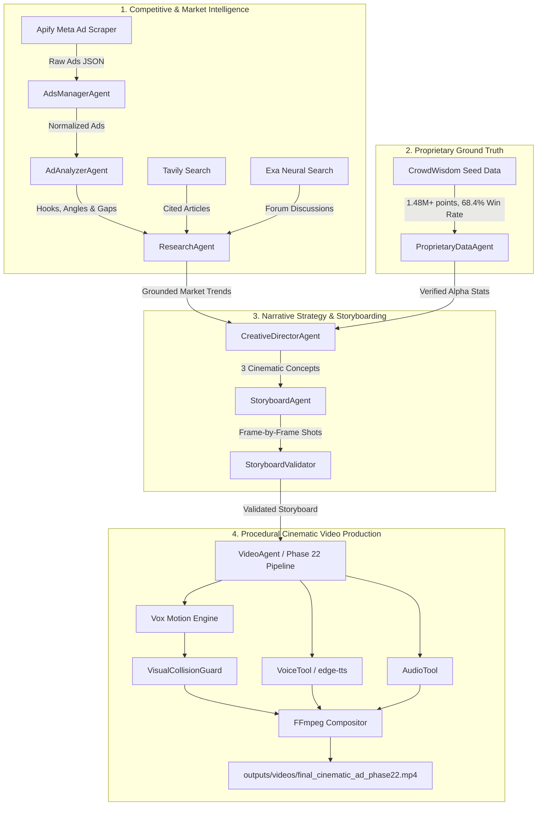

# Architecture Guide — CrowdWisdom Hermes AI Video Advertising System

This document outlines the architectural design, agent orchestration model, data flow, and procedural rendering engine powering the CrowdWisdom Hermes video advertising platform.

---

## 1. System Architecture Overview

The system bridges two operational domains:
1. **Hermes Multi-Agent Intelligence Layer:** An asynchronous multi-agent pipeline executing research, competitor ad dissection, ICP psychological grounding, proprietary data verification, creative strategy, and structured storyboard authoring.
2. **Procedural Vox-Inspired Motion Graphics Engine:** A 2.5D visual journalism compositor that transforms validated storyboards into broadcast-quality 1080x1920 vertical video advertisements using pure Python, Pillow, NumPy, and FFmpeg without relying on external generative video APIs.

```
+-----------------------------------------------------------------------------+
|                             USER / CLI INTERACTION                          |
|                     (main.py, scripts/render_final_cinematic_ad_phase22.py)  |
+-----------------------------------------------------------------------------+
                                       |
                                       v
+-----------------------------------------------------------------------------+
|                   HERMES MULTI-AGENT ORCHESTRATION LAYER                    |
|                         (workflows/marketing_pipeline.py)                   |
|                                                                             |
|  +--------------------+   +--------------------+   +---------------------+  |
|  |  AdsManagerAgent   |   |   AdAnalyzerAgent  |   |    ResearchAgent    |  |
|  |  (Apify Meta Ads)  |-->|  (Hooks & Angles)  |-->|   (Tavily & Exa)    |  |
|  +--------------------+   +--------------------+   +---------------------+  |
|                                                               |             |
|                                                               v             |
|  +--------------------+   +--------------------+   +---------------------+  |
|  | StoryboardValidator|<--|  StoryboardAgent   |<--|CreativeDirectorAgent|  |
|  | (Constraint Check) |   |  (Pacing & Scenes) |   | (3-Concept Strategy)|  |
|  +--------------------+   +--------------------+   +---------------------+  |
|                                                               ^             |
|                                                               |             |
|                                                    +---------------------+  |
|                                                    |ProprietaryDataAgent |  |
|                                                    |(CrowdWisdom Ground) |  |
|                                                    +---------------------+  |
+-----------------------------------------------------------------------------+
                                       |
                                       v Validated Storyboard & Voice Script
+-----------------------------------------------------------------------------+
|                   PROCEDURAL VOX-INSPIRED MOTION ENGINE                     |
|                         (tools/vox_motion_engine.py)                        |
|                                                                             |
|  - 2.5D Camera & Parallax (Camera25D: Z-Depth, Pan, Dynamic Zoom)           |
|  - Visual Entities: HalftoneTraderFigure, NewspaperFragment, KineticText     |
|  - Data Visualizations: AnimatedStatCounter, NetworkMeshLayer, MicroCharts  |
|  - Quality Enforcement: VisualCollisionGuard (Bounding Box & Margins)       |
|  - Voice Synthesis: VoiceTool (edge-tts / local pyttsx3 fallback)           |
|  - Audio Mixing & Ducking: AudioTool (Stereo Music + Ducked SFX + Voice)    |
+-----------------------------------------------------------------------------+
                                       |
                                       v Raw Frame Buffer (PIL / NumPy)
+-----------------------------------------------------------------------------+
|                          FFMPEG ENCODING SUBSYSTEM                          |
|                            (tools/ffmpeg_tool.py)                           |
|                                                                             |
|  - Video Stream: H.264 (libx264, yuv420p, 1080x1920, 30.0 fps)              |
|  - Audio Stream: AAC Stereo, 44.1 kHz, 192 kbps                             |
|  - Strict Audio/Visual Sync & 1.09s Outro Hold                              |
+-----------------------------------------------------------------------------+
                                       |
                                       v
               outputs/videos/final_cinematic_ad_phase22.mp4
```

---

## 2. Multi-Agent Roster & Responsibilities



### Agent Directory:
1. **`AdsManagerAgent` (`agents/ads_manager.py`)**:
   - Queries Meta Ad Library via Apify actor `apify/facebook-ads-scraper`.
   - Filters active 30-day competitive financial ads.
   - Normalizes ad text, headlines, creative formats, and landing page URLs into `data/processed/ads.json`.
2. **`AdAnalyzerAgent` (`agents/ad_analyzer.py`)**:
   - Dissects scraped ads via Hermes-3 (`nousresearch/hermes-3-llama-3.1-70b`).
   - Identifies 0–3 second opening hooks, acute trader pain points, emotional drivers, and calls to action.
   - Isolates CrowdWisdom's strategic "white space" and unique creative opportunities in `data/processed/ad_analysis.json`.
3. **`ResearchAgent` (`agents/research_agent.py`)**:
   - Executes live searches via Tavily (authoritative financial citations) and Exa (retail trader sentiment on Reddit and trading forums).
   - Grounds creative arguments in verified macroeconomic trends without hallucination.
   - Saves findings to `data/research/current_icp_research.json`.
4. **`ProprietaryDataAgent` (`agents/proprietary_data_agent.py`)**:
   - Reads verified CrowdWisdom platform metrics from `data/seed_data/` and `data/company_info.txt`.
   - Injects verified ground-truth data points: 1.48M+ market predictions analyzed, 68.4% directional accuracy, and 48-hour institutional signal lead time.
5. **`CreativeDirectorAgent` (`agents/creative_agent.py`)**:
   - Develops 3 distinct 30–60s creative ad concepts (e.g., Financial Thriller, Collective Intelligence, Data Documentary).
   - Formulates emotional narrative arcs, 0–3 second sound-off scroll stoppers, and screenplay-grade voiceover text.
6. **`StoryboardAgent` & `StoryboardValidator` (`agents/storyboard_agent.py`, `agents/storyboard_validator.py`)**:
   - Converts approved concepts into 8–12 scene storyboards with precise duration, 35mm camera instructions, visual entity rosters, and voiceover pacing.
   - Strict validator confirms duration sums, voiceover word rate (< 2.8 words/sec), and verified proprietary data anchor points.
7. **`VideoAgent` (`agents/video_agent.py`)**:
   - Orchestrates asset generation and passes composition instructions to the rendering engine.

---

## 3. Phase 22 Procedural Rendering Engine Architecture

The master video pipeline implemented in [`scripts/render_final_cinematic_ad_phase22.py`](../scripts/render_final_cinematic_ad_phase22.py) and [`tools/vox_motion_engine.py`](../tools/vox_motion_engine.py) operates as follows:

```
                          Scene Configuration (Scenes 1 - 6)
                                         |
                                         v
                         +-------------------------------+
                         |      VoxMotionComposition     |
                         |   (1080x1920, 30 fps, 48.5s)  |
                         +-------------------------------+
                                         |
               +-------------------------+-------------------------+
               |                                                   |
               v                                                   v
   Visual Elements Hierarchy                             Camera & Environment
   -------------------------                             --------------------
   1. HalftoneTraderFigure                               1. Camera25D (Z-Depth, Pan, Zoom)
   2. NewspaperFragment & Documents                      2. Archival Paper Canvas (#EFE8DB)
   3. KineticTextObject & Headlines                      3. Subtle Grid Overlay (50px, 3.5% Opacity)
   4. AnimatedStatCounter (1.48M+ points)                4. Vignette Shadow (18% Multiplicative)
   5. NetworkMeshLayer (Node graph)
   6. MicroChartFragment & Radar
                                         |
                                         v
                         +-------------------------------+
                         |     VisualCollisionGuard      |
                         |  (Axis-Aligned Bounding Box)  |
                         |  - Text vs Chart Margin Check |
                         |  - Top/Bottom Safe Area Check |
                         +-------------------------------+
                                         |
                                         v Frame Buffer (Pillow RGBA -> RGB)
                         +-------------------------------+
                         |      FFmpeg Subprocess Pipe   |
                         |   (-f rawvideo -pix_fmt rgb24)|
                         +-------------------------------+
                                         ^
                                         | Audio Mixing
                         +-------------------------------+
                         |           AudioTool           |
                         |  - Neural Narration (edge-tts)|
                         |  - Master Bed Music (44.1kHz) |
                         |  - Automated Ducking (-14 dB) |
                         +-------------------------------+
                                         |
                                         v
                      outputs/videos/final_cinematic_ad_phase22.mp4
```

### Motion Primitives & Mathematical Easing
All object transitions and camera movements utilize mathematical easing functions:
- `ease_out_cubic(t)`: Smooth deceleration for document and card entries.
- `ease_out_back(t, s=1.70158)`: Kinetic overshoot for bold typographic headlines and badge reveals.
- `ease_in_quad(t)`: Smooth acceleration for camera transitions and narrative phase changes.

---

## 4. Visual Grammar & Structural Rhythm

The visual grammar avoids static slideshow layouts by maintaining continuous visual progression:

$$\text{Spoken Narration} \longrightarrow \text{Visual Argument} \longrightarrow \text{Object Transformation} \longrightarrow \text{2.5D Camera Move} \longrightarrow \text{Next Argument}$$

### Master Scene Breakdown (48.5 Seconds Total)
1. **Scene 1 (0.0s – 6.0s) — The Sensory Hook:**
   - Visual: Halftone trader illuminated in dark room, arriving market charts, drowning in sensory noise.
   - Narration: *"At 2:17 in the morning, a trader isn't fighting the market. They're drowning in it."*
2. **Scene 2 (6.0s – 14.0s) — The Feed Illusion:**
   - Visual: Chaotic collage of conflicting headline fragments, social alerts, and red ticker noise.
   - Narration: *"Ten tabs open. Conflicting analysts. 1,400 noisy social alerts every hour. You think you're gathering information. You're actually absorbing noise."*
3. **Scene 3 (14.0s – 22.0s) — The Institutional Advantage:**
   - Visual: Financial newspaper clippings, structural shift from retail chaos to institutional order.
   - Narration: *"Institutions don't trade headlines. They trade consensus shifts. While retail traders chase yesterday's news, algorithmic consensus has already priced it in."*
4. **Scene 4 (22.0s – 31.0s) — The CrowdWisdom Signal:**
   - Visual: Radar sweep, archival grid isolation, verified counter accelerates and locks on **1,482,930** verified data points.
   - Narration: *"CrowdWisdom doesn't give you more noise. We filter 1.48 million market data points to isolate verified sentiment and directional consensus."*
5. **Scene 5 (31.0s – 39.5s) — The Visual Proof:**
   - Visual: 68.4% directional accuracy benchmark and verified 48-hour institutional lead time timeline.
   - Narration: *"A 68.4% historical accuracy rate. 48 hours before major trend breakouts. Clear, directional conviction before the market moves."*
6. **Scene 6 (39.5s – 48.5s) — The Resolution & Action:**
   - Visual: Editorial brand lockup, clean typography, final website CTA card with 1.09s audio breathing hold.
   - Narration: *"Stop fighting the feed. Start trading the consensus. CrowdWisdom Trading. Visit crowdwisdomtrading.com."*
