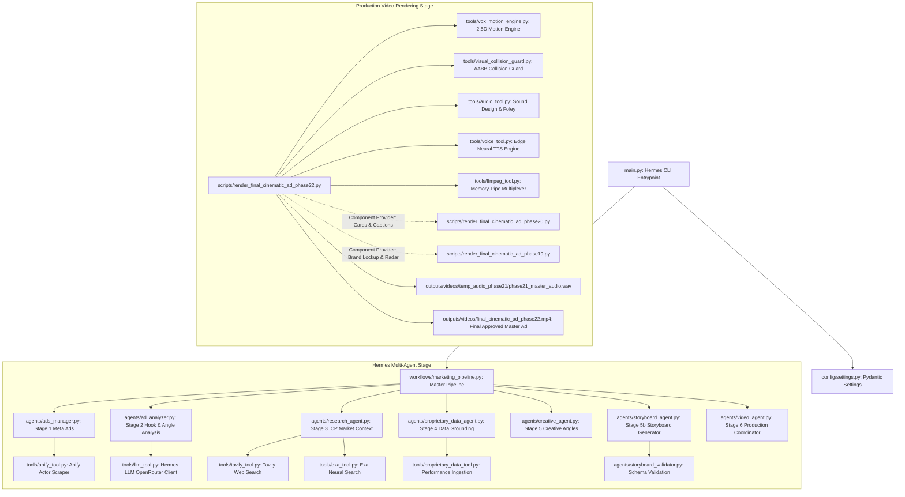

# Phase 23: Production Dependency Graph & Architectural Trace

> **Target Video**: `outputs/videos/final_cinematic_ad_phase22.mp4`  
> **Master Framework**: NousResearch Hermes-3 / OpenRouter Multi-Agent Workflow  
> **Production Renderer**: `scripts/render_final_cinematic_ad_phase22.py`  
> **Generated**: September 20, 2026

---

## 1. End-to-End Production Execution Trace

The repository contains two intertwined system layers:
1. **The Assessment Hermes Multi-Agent Framework** (`main.py` -> `workflows/marketing_pipeline.py`), which coordinates market research, ad analysis, ICP deep-dive, creative synthesis, and video orchestration.
2. **The Procedural 2.5D Vox Motion Graphics Engine** (`scripts/render_final_cinematic_ad_phase22.py` -> `tools/vox_motion_engine.py`), which produces the approved 48.5-second master ad video (`outputs/videos/final_cinematic_ad_phase22.mp4`).

---

## 2. Comprehensive File Classification

Every Python file across the repository has been evaluated against direct imports, dynamic calls, CLI execution, and component dependencies.

### Class: `ACTIVE_PRODUCTION` (6 Files)
*Directly required to build and render `final_cinematic_ad_phase22.mp4`.*
- `scripts/render_final_cinematic_ad_phase22.py`: The master production script.
- `tools/vox_motion_engine.py`: The 2.5D spatial camera, halftone dot matrix, kinetic typography, and network graph engine.
- `tools/visual_collision_guard.py`: AABB spatial collision checker and safe-margin boundary validator.
- `tools/voice_tool.py`: Neural voiceover generator using Microsoft Edge TTS (`ChristopherNeural`).
- `tools/audio_tool.py`: Procedural Foley, 50Hz sub-bass synthesis, and EBU R128 mastering.
- `tools/ffmpeg_tool.py`: Low-overhead direct memory-pipe FFmpeg encoder.

### Class: `ACTIVE_SUPPORT` (25 Files)
*The active Hermes multi-agent framework fulfilling the original assessment assignment.*
- `main.py`: Interactive CLI entrypoint, diagnostics, and stage triggers.
- `config/settings.py`: Central Pydantic environment configuration loader.
- `workflows/marketing_pipeline.py`: Orchestrator for the 6-stage multi-agent pipeline.
- `agents/ads_manager.py`: Coordinates Meta Ad Library research via Apify.
- `agents/ad_analyzer.py`: Analyzes competitor hooks, angles, and CTA patterns.
- `agents/research_agent.py`: Conducts ICP pain-point research via Tavily and Exa.
- `agents/proprietary_data_agent.py`: Validates and grounds performance statistics (`1,482,930`, `68.4%`, `14.6h`).
- `agents/creative_agent.py`: Generates 3 differentiated editorial angles.
- `agents/storyboard_agent.py`: Converts concepts into structured visual scene storyboards.
- `agents/storyboard_validator.py`: Validates storyboard schema, scene durations, and audio keys.
- `agents/video_agent.py`: Directs the overall video rendering process.
- `agents/creative_video_qa.py`: QA agent auditing output assets against creative specs.
- `agents/phase10_qa_auditor.py`: Compliance verification auditor for audio/video specs.
- `tools/llm_tool.py`: OpenRouter / NousResearch Hermes LLM client.
- `tools/apify_tool.py`: Scrapes Meta Ads Library via Apify Actor.
- `tools/tavily_tool.py`: Real-time web intelligence tool.
- `tools/exa_tool.py`: Neural semantic web search tool.
- `tools/proprietary_data_tool.py`: Ingestion parser for CSV, PDF, and Excel internal data.
- `tools/data_visualization_tool.py`: Generates data charts and overlay plots.
- `tools/style_prompt_system.py`: Enforces archival visual prompt constraints.
- `tools/phase11_prompt_system.py`: Cinematography prompt constructor.
- `tools/video_generation_tool.py`: External video generation job dispatcher.
- `tools/video_provider.py`: Video generation provider abstraction layer.
- `tools/openmontage_tool.py`: Local OpenMontage integration tool.
- `tools/editorial_compositor.py`: Multi-layer video compositor with text and matte overlays.

### Class: `LEGACY_BUT_REFERENCED` (2 Files)
*CRITICAL: Historical renderers that provide active class definitions imported by Phase 22.*
- `scripts/render_final_cinematic_ad_phase20.py`:
  - **Imported by Phase 22**: `NotificationAlertBubble`, `MicroChartFragment`, `EditorialCaptionObject`, `AccuracyComparisonCardAudited`, `TimelineLeadObjectAudited`.
  - **Status**: Protected. Must NOT be deleted.
- `scripts/render_final_cinematic_ad_phase19.py`:
  - **Imported by Phase 22**: `BrandResolutionLockup`, `RadarDirectionalObject`.
  - **Status**: Protected. Must NOT be deleted.

### Class: `LEGACY_UNREFERENCED` (11 Files)
*Historical phase implementations from iterative milestones (Phases 10–21) that are no longer imported by production.*
- `scripts/render_final_cinematic_ad_phase21.py`: Phase 21 master ad script (superseded by Phase 22).
- `scripts/render_phase18_ad.py`: Discarded intermediate experimental ad renderer.
- `scripts/render_phase17_style_proof.py`: Style test proof rejected for looking like a presentation.
- `scripts/generate_phase16_storyboard.py`: Hardcoded script generator superseded by motion script.
- `scripts/render_phase14_ad.py`: Discontinued stock-footage commercial renderer.
- `scripts/generate_phase14_audio.py`: Old audio generator without EBU R128 normalization.
- `scripts/generate_phase14_storyboard.py`: Discontinued Phase 14 storyboard generator.
- `scripts/extract_phase14_frames.py`: Utility script extracting frames from discarded Phase 14 video.
- `scripts/phase12_discovery.py`: Early OpenMontage hardware probe script.
- `scripts/run_phase12_hero.py`: Early generative AI hero shot test runner.
- `tools/cinematic_vox_system.py`: Early procedural visual system superseded by `vox_motion_engine.py`.

### Class: `POTENTIALLY_UNUSED` (10 Files)
*Utility scripts, abandoned stock-footage tools, or package inits with no active inbound calls.*
- `scripts/fetch_footage.py`: Stock footage downloader from Phase 14 (stock footage eliminated in Phase 15).
- `scripts/generate_overlays.py`: Static overlay generator from Phase 14.
- `scripts/probe_footage.py`: Single-file media probe utility.
- `scripts/render_vox_motion_proof_v2.py`: Approved 10s motion reference proof from Phase 19.
- `agents/style_prompt_validator.py`: Standalone prompt validator unreferenced by active agents.
- `tools/video_tool.py`: Legacy OpenCV/imageio wrapper superseded by `ffmpeg_tool.py`.
- `agents/__init__.py`: Package initializer.
- `tools/__init__.py`: Package initializer.
- `config/__init__.py`: Package initializer.
- `workflows/__init__.py`: Package initializer.

### Class: `TEST` (14 Files)
*Unit tests, integration tests, and validation scripts.*
- `tests/test_vox_motion_engine.py`: Unit tests for 2.5D motion primitives and math.
- `tests/test_cinematic_vox_system.py`: Tests for archival procedural graphics.
- `tests/test_ads_schema.py`: Schema validation tests for Meta Ads scraper.
- `tests/test_creative_phase5.py`: Creative director concept generation tests.
- `tests/test_phase7_production.py`: Phase 7 production tests.
- `tests/test_phase8_production.py`: Phase 8 production tests.
- `tests/test_phase9_art_direction.py`: Art direction validation tests.
- `tests/test_phase10_production.py`: Production pipeline tests.
- `tests/test_phase11_cinematic.py`: Cinematic prompt tests.
- `tests/test_phase12_openmontage.py`: OpenMontage backend integration tests.
- `tests/test_phase14_production.py`: Phase 14 validation tests.
- `tests/run_storyboard_validation.py`: Standalone storyboard test runner.
- `scripts/run_phase17_style_test.py`: Phase 17 validation script.
- `scripts/test_synth_p19.py`: TTS audio synthesis test script.

### Class: `UNKNOWN` (0 Files)
*Every file in the repository has been definitively mapped and understood.*
